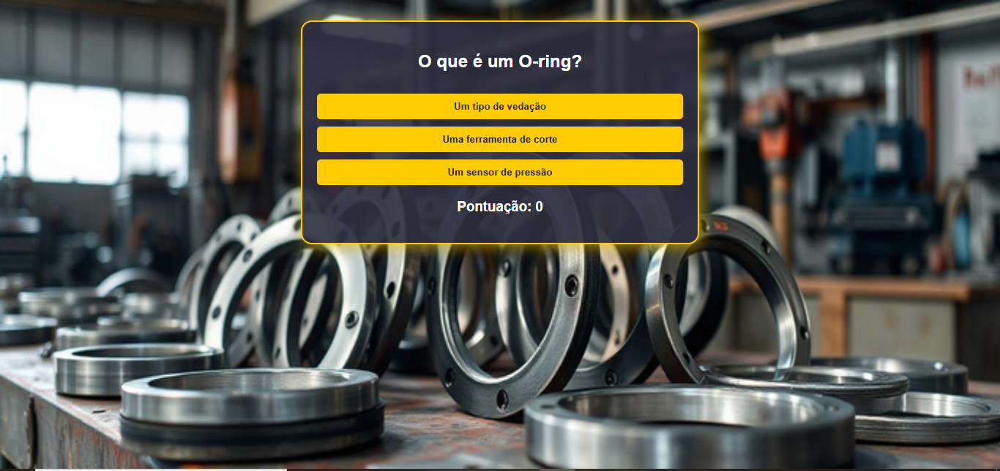

Este é um quiz interativo sobre vedação industrial. Ele apresenta perguntas de múltipla escolha e calcula a pontuação do usuário.

## 🚀 Tecnologias Utilizadas
- HTML
- CSS
- JavaScript

## 📌 Como Rodar o Projeto
1. Baixe ou clone este repositório
2. Abra o arquivo `index.html` em um navegador

## 📷 Preview do Projeto
 *(Adicione uma imagem aqui se quiser)*

## 🏆 Objetivo do Projeto
Criar um quiz interativo para testar conhecimentos sobre vedação industrial.
